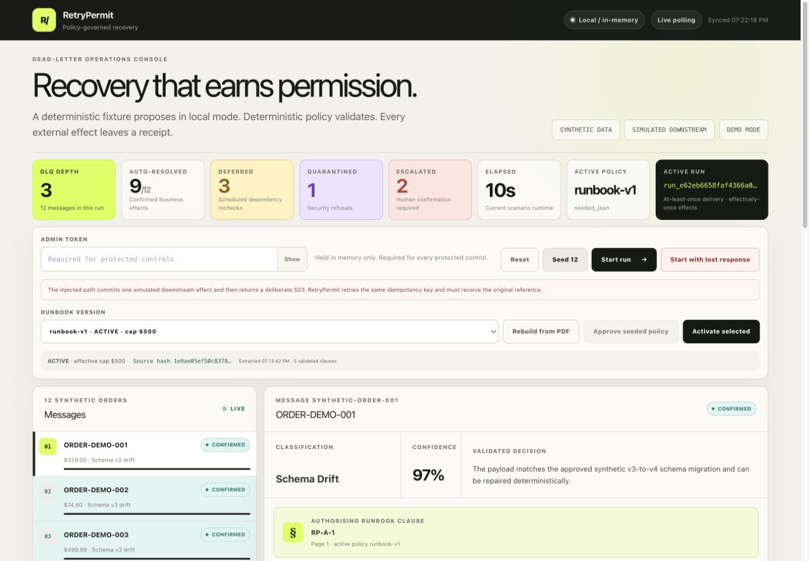
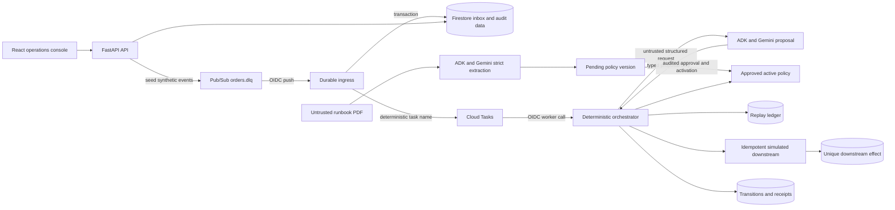
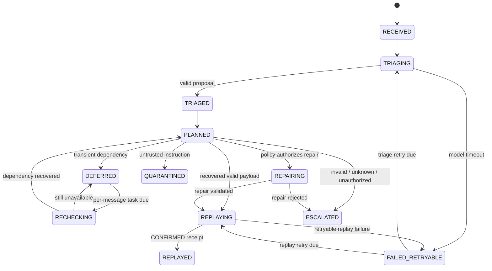
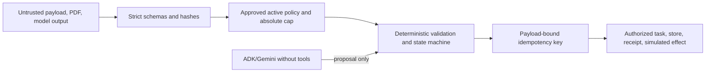

# RetryPermit

RetryPermit is a policy-governed recovery service that triages a failed event, validates an allowlisted repair, and replays it with an auditable receipt trail and one idempotent simulated business effect.



For a screenshot-led explanation of the deployed runtime, start with the [Google Cloud setup learning guide](docs/cloud-setup-learning.md).

> **Demo disclosure:** every included message, customer, order, product, and policy is synthetic. The downstream order processor is simulated. Local mode uses an in-memory store and inline processing, so it is a convenience demonstration—not proof of durable delivery or a Google Cloud deployment.

## 2. Target user and operational friction

RetryPermit is for the on-call engineer responsible for an event-driven order pipeline. In their words: “A dead-letter event wakes me up, and I have to reconstruct the failure, find the right runbook clause, decide whether a repair is safe, avoid duplicating an order that may already have committed, retry it, and leave evidence for the next person.”

## 3. At-least-once delivery with effectively-once downstream business effects

RetryPermit is designed for **at-least-once message delivery with effectively-once downstream business effects**. It does not claim exactly-once delivery. Duplicate transport deliveries are expected; the deterministic replay ledger and a separately queryable, transactionally unique downstream-effect record prevent a second business effect for the same namespaced idempotency key.

## 4. The model proposes; deterministic code executes

The model proposes; deterministic code executes. Gemini via Google ADK may return a structured triage proposal, confidence, concise evidence, policy clause, and allowlisted repairs. It has no tools or authority to write application state, publish messages, mint idempotency keys, activate policy, or call the downstream. Deterministic code validates the proposal against the approved active policy, applies the repair, creates the idempotency key, and records each attempted and confirmed or failed external effect. Payloads, policy material, evidence, and model output are untrusted input; hidden chain-of-thought is neither requested nor persisted.

| Capability | Model may propose | Deterministic code may execute |
| --- | :---: | :---: |
| Classification, evidence, policy citation | Yes | Validates and records |
| Allowlisted rename or type coercion | Yes | Yes, after policy/schema/cap checks |
| Publish or schedule messages | No | Yes |
| Write state, receipts, leases, or ledger | No | Yes |
| Mint/reuse an idempotency key | No | Yes |
| Call the downstream | No | Yes |
| Approve or activate policy | No | Protected operator action only |
| Exceed the application safety ceiling | No | No |

The current run contains 12 synthetic messages across four outcomes. Six Class A schema-v3 orders are repaired and replayed. Three Class B orders are valid but blocked by a simulated inventory 503; each gets its own scheduled recheck and replays unchanged after the dependency recovers. Two Class C orders contain a negative quantity or disallowed currency, so RetryPermit proposes a correction, withholds replay, and records an escalation. One Class D order embeds an instruction in its notes; deterministic code treats it as inert data, refuses it, and quarantines the message. The application-level $2,500 safety ceiling remains absolute.

Phase 2 also makes the ambiguous failure path visible. **Start with lost response** commits one idempotent simulated downstream effect and then deliberately loses the response with a simulated 503. RetryPermit records a replay-stage failure, schedules a bounded jittered retry using the same idempotency key, receives the original downstream reference, and confirms the ledger. The live proof endpoint and UI show `2 execution attempts → 1 unique downstream effect`.

## 5. Architecture

One FastAPI service hosts the API, private transport handlers, simulated downstream, and compiled React/Vite operations console. Cloud mode uses Pub/Sub, a durable Firestore inbox, deterministic Cloud Tasks, Firestore transactions, and dedicated OIDC identities. Local mode swaps these cloud boundaries for explicitly non-durable recording/in-memory adapters and processes the demo inline.



The Cloud Pub/Sub handler acknowledges only after the delivery/inbox record is durable and a deterministic Cloud Task is known to be scheduled. Each retryable message gets its own future Cloud Task at `next_attempt_at`; Cloud Scheduler is the recovery net for unfinished inbox items, expired replay leases, and missed due rechecks. Firestore transactions protect delivery deduplication, task/inbox coordination, policy approval and activation, transition sequence allocation, replay leases, ledger changes, and downstream-effect uniqueness.

See [architecture.md](docs/architecture.md) for the acknowledgement contract, component responsibilities, and persistence model.

## 6. State machine

The current state paths are:



The `failed_stage` field branches retryable recovery back to triage or replay so completed work is not repeated. See [state-machine.md](docs/state-machine.md) for every invariant and outcome path.

## 7. Lost-response retry sequence

```mermaid
sequenceDiagram
    participant W as Cloud Tasks worker
    participant O as Deterministic orchestrator
    participant L as Replay ledger
    participant D as Simulated downstream
    W->>O: Execute message
    O->>L: Reserve key K bound to payload hash H
    O->>D: Process order (K, H)
    D->>D: Commit unique effect E
    D--xO: Response lost after real effect (503)
    O->>L: Record retryable replay failure; retain K
    O-->>W: Schedule bounded retry
    W->>O: Retry same message
    O->>L: Verify H and reacquire lease for K
    O->>D: Process again (same K, same H)
    D-->>O: Return original reference E
    O->>L: Confirm K to E
```

The injected failure occurs at the simulated downstream after its effect, not at transport before an effect. Two attempts therefore produce one effect and the original downstream reference.

## 8. Google stack and why it is present

| Google component | Purpose in RetryPermit |
| --- | --- |
| Cloud Run | Hosts the UI, API, agent runner, workers, recovery route, and simulated downstream; scales to zero |
| Pub/Sub | At-least-once dead-letter event delivery |
| Firestore | Durable inbox, state transitions, receipts, leases, policy lifecycle, ledger, and effect proof |
| Cloud Tasks | One deterministic task per message, including future rechecks and retries |
| Cloud Scheduler | Recovery net for missing tasks and expired leases, not a replacement sweep loop |
| Google ADK | Runs the structured proposal agent inside the Cloud Run process |
| Gemini on Vertex AI | Produces typed triage and PDF policy-extraction proposals |
| IAM, service accounts, OIDC | Gives Pub/Sub, Tasks, Scheduler, and runtime separate machine identities |
| Secret Manager | Injects the administrator token at runtime |
| Cloud Logging | Preserves structured operational evidence |
| Cloud Billing budget | Sends spending alerts; it is not a hard cap |

Start with the [project-specific Google Cloud crash course](docs/google-cloud-crash-course.md) for the complete request path and official Google learning links.

## 9. Local setup

Requirements are Python 3.12 and Node.js 20 or newer with npm available. Start from the repository root:

```bash
cp .env.example .env
# Edit .env and replace DEMO_ADMIN_TOKEN with a long random local value.
make install
make web
make run
```

Open `http://127.0.0.1:8080` and enter the same administrator token. The token is supplied at runtime through `X-Admin-Token`; it is not compiled into the frontend source. Read-only synthetic demo views do not require it.

The default `.env.example` configuration is intentionally local:

- `DEMO_MODE=true`
- `USE_IN_MEMORY_STORE=true`
- `USE_FAKE_MODEL=true`
- `DEMO_RECHECK_SECONDS=10`

This path uses deterministic triage fixtures and the simulated downstream. It does not call Gemini, Pub/Sub, Cloud Tasks, Firestore, or another Google Cloud service and must not be described as cloud evidence.

## 10. Google Cloud deployment

Use a new, dedicated, billed Google Cloud project. Do not silently reuse an unrelated project. The read-only preflight and guarded deployment scripts are the repository's supported command paths:

```bash
export GCP_PROJECT_ID='<dedicated-retrypermit-project-id>'
export GCP_REGION='us-central1'
export GEMINI_LOCATION='global'
./infra/setup_budget.sh
./infra/preflight.sh

export DEMO_ADMIN_TOKEN='<long-random-secret>'
export CONFIRM_RETRYPERMIT_PROJECT='yes'
export CONFIRM_BUDGET_SAFEGUARDS='yes'
./infra/deploy.sh

# Only after both credentialed live tests pass:
export CONFIRM_LIVE_TESTS_PASSED='yes'
./infra/mark_cloud_verified.sh
```

Review the [Google Cloud crash course](docs/google-cloud-crash-course.md) and the guarded scripts before authorizing mutations. The deployment script enables the required APIs, creates least-purpose service accounts, creates Firestore and the task queue when absent, deploys the single Cloud Run service from source, creates the Pub/Sub push subscription, and configures the recovery scheduler. It prints and checks the real `/health` URL returned by Cloud Run; this README intentionally does not invent one.

Application authorization remains route-specific even though the deployment exposes the service URL for the read-only demo UI:

- Pub/Sub pushes to `/pubsub/dlq` with a Google-signed OIDC token for the dedicated Pub/Sub push service account.
- Cloud Tasks calls the private worker route with the dedicated task service account and the base Cloud Run URL as its OIDC audience.
- Cloud Scheduler calls `/internal/recovery/sweep` with the dedicated recovery service account and the same audience.
- Mutating demo controls require `X-Admin-Token`; no long-lived administrator credential belongs in frontend source.

After deployment, `/health` alone is insufficient evidence. A cloud-complete claim requires a real authenticated Pub/Sub delivery, deterministic Cloud Task execution, live ADK/Gemini structured output, Firestore records, a confirmed replay receipt, and an independently queried single downstream effect.

### Configuration

Application settings are read from environment variables (or `.env` locally):

| Variable | Default / requirement | Purpose |
| --- | --- | --- |
| `APP_ENV` | `local` | Environment label; deployment sets `cloud`. |
| `DEMO_MODE` | `true` | Enables explicit local/demo behavior; cloud sets `false`. |
| `USE_IN_MEMORY_STORE` | `true` | Uses the non-durable local store; cloud must set `false`. |
| `USE_FAKE_MODEL` | `true` | Uses deterministic triage fixtures; cloud must set `false`. |
| `ALLOW_LOCAL_SERVICE_AUTH` | `false` | Local-only service-auth bypass; refused outside demo mode. |
| `CLOUD_DEPLOYMENT_VERIFIED` | `false` | Guarded evidence flag; set true only after both live cloud tests pass. |
| `DEMO_ADMIN_TOKEN` | required for controls | Secret supplied in `X-Admin-Token`; use a long random value. |
| `LOG_LEVEL` | `INFO` | Application log level. |
| `GOOGLE_CLOUD_PROJECT` | required with Firestore | Dedicated Google Cloud project ID. |
| `GOOGLE_CLOUD_LOCATION` | `global` | Gemini publisher-model location. |
| `GOOGLE_GENAI_USE_ENTERPRISE` | `TRUE` | Selects the Google Cloud/Vertex integration path. |
| `GEMINI_MODEL` | `gemini-3.7-flash` | Configurable Gemini model identifier. |
| `CLOUD_RUN_REGION` | `us-central1` | Cloud Run infrastructure region. |
| `PUBSUB_TOPIC` | `orders.dlq` | Synthetic dead-letter topic. |
| `CLOUD_TASKS_LOCATION` | `us-central1` | Task queue region. |
| `CLOUD_TASKS_QUEUE` | `retrypermit-processing` | Durable processing queue. |
| `SERVICE_BASE_URL` | required in cloud mode | Deployed Cloud Run base URL used by tasks. |
| `OIDC_AUDIENCE` | required in cloud mode | Expected base Cloud Run URL audience. |
| `PUBSUB_PUSH_SERVICE_ACCOUNT` | required in cloud mode | Exact allowed Pub/Sub push identity. |
| `CLOUD_TASKS_SERVICE_ACCOUNT` | required in cloud mode | Exact allowed task worker identity. |
| `RECOVERY_SERVICE_ACCOUNT` | required in cloud mode | Exact allowed scheduler/recovery identity. |
| `REPLAY_RETRY_BASE_SECONDS` | `1` | Base delay for bounded exponential replay retry. |
| `REPLAY_RETRY_MAX_SECONDS` | `10` | Maximum replay retry delay before jitter is capped. |
| `MODEL_TIMEOUT_SECONDS` | `20` | Per-call structured triage timeout. |
| `DOWNSTREAM_TIMEOUT_SECONDS` | `10` | Per-call simulated downstream timeout. |
| `POLICY_EXTRACTION_TIMEOUT_SECONDS` | `45` | Per-call PDF extraction timeout. |

Deployment-script inputs also include `GCP_PROJECT_ID`, optional `GCP_REGION`, optional `GEMINI_LOCATION`, optional `FIRESTORE_LOCATION`, optional `SERVICE`, optional `TASK_QUEUE`, optional `TOPIC`, and the explicit safety confirmations `CONFIRM_RETRYPERMIT_PROJECT=yes` and `CONFIRM_BUDGET_SAFEGUARDS=yes`.

Application Default Credentials are used for Google Cloud access. Do not commit API keys, service-account JSON, `.env`, or administrator secrets.

`requirements.lock` records the exact resolved Python environment used for Phase 1, including `google-adk==2.8.0`; the container build installs that lock before installing RetryPermit itself without re-resolving dependencies.

Reset preserves each previous run and assigns it a 30-day expiration timestamp. The guarded cleanup utility recursively removes expired synthetic run documents and their subcollections; it is dry-run by default:

```bash
.venv/bin/python infra/cleanup_expired_runs.py \
  --project '<dedicated-retrypermit-project-id>'

# Only after reviewing the dry-run output:
.venv/bin/python infra/cleanup_expired_runs.py \
  --project '<dedicated-retrypermit-project-id>' \
  --execute --confirm=delete-expired-synthetic-runs
```

## 11. Demo instructions

1. Click **Reset** to rotate to a fresh run; prior evidence remains namespaced rather than being erased.
2. Click **Seed 12** if the run is empty, then click **Start run**.
3. Select message 7 for Class B deferral/recheck, message 10 for Class C replay-withheld escalation, and message 12 for Class D quarantine/refusal.
4. Start a separate reset run with **Start with lost response**, then click **Prove effectively once** to show two attempts and one effect.
5. Inspect the active policy hash, approval/activation events, effective cap, transition history, and phase-grouped receipts.

The local fixture uses a disclosed 10-second Class B override and completes with 9 replayed, 2 escalated, 1 quarantined, and DLQ depth 3. Approved production policies currently use 300 seconds. Read the [four-minute demo script](docs/demo-script.md) before recording; it identifies the owner decision needed for truthful cloud timing.

The optional live duplicate-redelivery control was not added. Duplicate-delivery deduplication is covered by automated tests; screenshots and videos must not imply Pub/Sub spontaneously redelivered during the demo.

## 12. Test instructions

The normal suite is local, deterministic, credential-free, and non-billable:

```bash
make test
make lint
make web
```

The reusable frozen-run gate is:

```bash
.venv-phase2/bin/python scripts/phase4_freeze_gate.py
```

Two tests are intentionally skipped by the normal suite: the deployed vertical slice and real Gemini integration. They require explicit owner authorization, live credentials, and billable Google Cloud calls. A skip is never reported as a pass.

The complete requirement-to-test mapping is in [phase5-test-matrix.md](docs/phase5-test-matrix.md).

## 13. Synthetic-data disclosure

Every included message, order, customer, product, policy, recipient, downstream reference, and outcome is synthetic. No employer, customer, payment, or production operations data is included or required.

## 14. Simulated-downstream disclosure

The downstream order processor is mocked as an idempotent in-service simulation. It stores a unique business-effect record for a namespaced key, returns the original reference on duplicate requests, can simulate inventory 503/recovery, and can deliberately lose a response after committing an effect. It does not call a real order, inventory, payment, ERP, or commerce system.

Pub/Sub, Cloud Tasks, Firestore, Cloud Run, OIDC, Google ADK, and Gemini are real only in an explicitly configured cloud run. Their local adapters are deterministic conveniences and are labeled accordingly.

## 15. Security boundaries



Machine routes require dedicated OIDC identities. Mutating demo/policy routes require `X-Admin-Token`, stored in Secret Manager in cloud mode and never compiled into frontend code. Reset rotates namespaces; cleanup is explicit, dry-run by default, project-name guarded, and separately confirmed. Details: [security.md](docs/security.md) and [runbook-policy.md](docs/runbook-policy.md).

## 16. Contest-period and development disclosure

**Owner confirmation required before submission:** the final entry must truthfully state whether the project was newly created during the contest submission period, that AI coding assistants were used, and whether any pre-existing code was incorporated. The repository does not infer entrant eligibility, employer outside-activity approval, creation dates, or ownership. These remain unchecked until the owner confirms them and preserves supporting evidence.

## 17. Tradeoffs and limitations

- The hackathon vertical slice combines API, worker, and simulated downstream in one Cloud Run service. Production should split trust and scaling domains.
- Local mode is fast and deterministic but proves neither cloud durability nor real model behavior.
- The 10-second local Class B interval is an explicit override; approved production policies currently specify 300 seconds.
- The optional UI control for duplicate Pub/Sub redelivery was cut. Deduplication is covered by automated tests rather than the video.
- The current 12-message dataset produces the same final outcome under v1/v2; the policy-caused $750 decision change is preserved in the six-message Phase 2 test/evidence.
- Phase 3/4 behavior is locally frozen but still awaits an authorized final cloud verification.
- The downstream, dependency recovery, and business records are simulations; real integrations need contracts, authentication, reconciliation, and failure testing.
- Name/trademark, dependency-license, security, privacy, retention, and commercial readiness reviews remain before sale.

## 18. Findings and learnings

The strongest agent architecture gave the model less authority, not more. Gemini is valuable for classification, evidence synthesis, and policy-grounded proposals; deterministic schemas, hashes, caps, state machines, leases, and idempotency are better for authorization and side effects.

The hardest reliability case was not a failed request but an ambiguous result: the effect succeeded and only the response failed. Modeling that boundary forced the design to reuse one payload-bound key and prove the effect independently of the application response.

Per-message Cloud Tasks and a Scheduler recovery net solve different problems. Tasks express when one message should run; Scheduler reconciles missing or abandoned work. Combining them preserves prompt recovery without turning the system into a global sweep loop.

Finally, an operations console is part of the control system. Showing the policy clause, repair diff, transition history, receipts, and independent effect count lets a reviewer understand why an autonomous action was safe.

### Latest readiness check — August 31, 2026

The reliability fixes are deployed: policy changes cannot strand a RUNNING run, workers revalidate authority before using cached definitions, and Start resumes partial publication with its original mode. The proposal context now covers all four classes and the active currency/cap limits. **66 local tests passed, 2 cloud-only tests skipped by default**; lint, formatting, TypeScript/Vite and four fake-only freeze scenarios passed.

With explicit owner approval, real ADK/Gemini triage, PDF extraction, v3 approval/activation and two full cloud workflows were exercised. Both runs finished **9 replayed / 2 escalated / 1 quarantined**, with three real five-minute rechecks and nine independently verified Firestore effects each. The lost-response case proved two requests and one effect. Historical v2 was preserved; separately extracted v3 is active. Current revision `retrypermit-00021-szl` uses the tested image and reports `cloud_deployment_verified=true`.

The initial test command caught an incorrect assertion about archived runs; after correcting it locally, the same completed runs passed read-only evidence revalidation. See the [full report and honest test accounting](docs/final-verification-2026-08-31.md), [ADR-018](docs/decisions.md) and [test matrix](docs/phase5-test-matrix.md). The final public video, owner declarations and Devpost submission are still outstanding.

### Historical verification status

As of 2026-08-27, the Phase 5 local verification is complete and Phase 2 has historical cloud evidence:

```text
.venv/bin/ruff check src tests infra
All checks passed!

.venv/bin/ruff format --check src tests infra
Passed

.venv-phase2/bin/pytest -q
42 passed, 2 skipped, 1 upstream deprecation warning

cd frontend && npm run build
TypeScript and Vite production build succeeded

cd frontend && npm audit --audit-level=high
found 0 vulnerabilities
```

Ruff check and format check passed, the TypeScript/Vite production build passed, local Markdown targets resolved, and the repository secret-pattern scan found no API key or private-key material. The three-scenario local freeze gate also passed again in 10.025, 10.031, and 10.027 seconds with identical 9/3/2/1 outcomes and zero Google Cloud calls.

The two default-suite skips are deliberately gated live-integration checks. Historical Phase 2 cloud acceptance passed with the Cloud Run URL, administrator token, and dedicated project. The passing local suite additionally covers all four outcome classes, ambiguous 503/timeout recovery, bounded jitter and retry exhaustion, live proof aggregation, PDF safety, approval/activation audit events, cold-start policy preservation, and the v1/v2 decision change.

The production container built and passed a local Phase 2 smoke run. `/health` reported `Local / in-memory`; the injected path reported one recorded delivery, two execution attempts, two downstream requests, one unique downstream effect, and a confirmed ledger. Under v1 the run resolved five messages and escalated the $750 order. The temporary container was removed after verification.

Historical Phase 2 cloud status was **deployed and live-verified** in the dedicated `retrypermit-hackathon-2026` project. Revision `retrypermit-00016-ckm` reported `cloud_deployment_verified=true`. This does not prove that the frozen Phase 3/4 12-message behavior is present in the current live revision; that check remains gated.

The Phase 2 acceptance run verified the injected response loss after a committed effect, two replay attempts to one effect, and the original downstream reference. Real Gemini PDF extraction produced runbook v2; audited approval and activation changed the same $750 message from v1 escalation to v2 replay with no code change. Independent Firestore queries found five unique effects in the v1 failure run and six in the v2 run. Evidence: [local failure overview](docs/media/local-phase2-failure-overview.png), [live effectively-once proof](docs/media/local-phase2-effectively-once-proof.png), and [deployed v2 completion](docs/media/cloud-phase2-v2-complete.png). See also [the cloud setup learning guide](docs/cloud-setup-learning.md) and [decisions.md](docs/decisions.md).

## 19. Hackathon compliance checklist

These are intentionally unchecked; they must not be converted into claims without explicit confirmation and supporting evidence:

- [ ] Entrant eligibility and any employer outside-activity position are confirmed.
- [ ] Contest-period creation and any prior-work disclosure are confirmed.
- [x] Exactly one category is selected in the draft: **Taskmaster**.
- [x] Gemini 3.5+, Google ADK, and Google Cloud infrastructure are genuinely implemented in the preserved production path.
- [x] Phase 3/4 final cloud verification is explicitly authorized and completed; see the August 31 report, including the corrected test assertion.
- [ ] Public English video is no more than four minutes, shows live execution and Google Cloud proof, and opens signed out.
- [x] Repository URL is public; public metadata and signed-out access were checked.
- [x] Step-by-step setup and architecture/state/sequence/security diagrams are present.
- [x] Synthetic data, simulated downstream, local override, and test/video limitations are disclosed.
- [ ] Every third-party asset and dependency is appropriately licensed for submission and distribution.
- [ ] Secret scan and final repository review confirm no credentials or employer data are committed.
- [x] Final local and authorized cloud test counts are recorded honestly in the August 31 report.
- [ ] Hosted/test link and credentials are supplied separately from deployment proof.
- [ ] Every submitted link is reopened signed out; the submission is reopened once and saved again.
- [ ] The RetryPermit name completes trademark, company-name, package-registry, app-store, and domain clearance before commercial release.

The working product name is **RetryPermit**: policy-governed recovery for failed events. It has plausible commercial scope as an operations-control layer for teams running event-driven systems, but name clearance, production hardening, customer discovery, and deployment evidence are prerequisites to selling it. Submission copy: [devpost-submission.md](docs/devpost-submission.md).

## 20. License

RetryPermit is released under the [MIT License](LICENSE). This covers RetryPermit's own source, fixtures, and documentation. It is not a review of third-party dependency licensing, which remains on the compliance checklist above.
