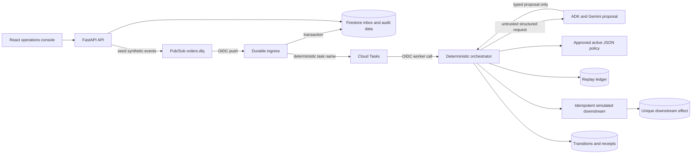
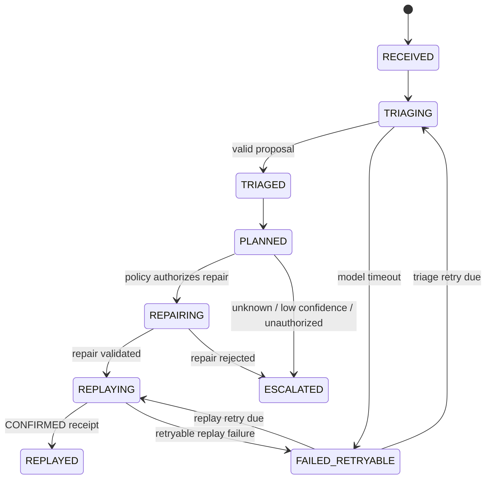

# RetryPermit

RetryPermit is a policy-governed recovery service that triages a failed event, validates an allowlisted repair, and replays it with an auditable receipt trail and one idempotent simulated business effect.

New to the project? Start with the [training guide](docs/training-guide.md) for the system flow, Google Cloud runtime model, value proposition, hands-on exercise, and phase status.

> **Phase 1 disclosure:** every included message, customer, order, product, and policy is synthetic. The downstream order processor is simulated. Local mode uses an in-memory store and inline processing, so it is a convenience demonstration—not proof of durable delivery or a Google Cloud deployment.

## What it proves

RetryPermit is designed for **at-least-once message delivery with effectively-once downstream business effects**. It does not claim exactly-once delivery. Duplicate transport deliveries are expected; the deterministic replay ledger and a separately queryable, transactionally unique downstream-effect record prevent a second business effect for the same namespaced idempotency key.

The model proposes; deterministic code executes. Gemini via Google ADK may return a structured triage proposal, confidence, concise evidence, policy clause, and allowlisted repairs. It has no tools or authority to write application state, publish messages, mint idempotency keys, activate policy, or call the downstream. Deterministic code validates the proposal against the approved active policy, applies the repair, creates the idempotency key, and records each attempted and confirmed or failed external effect. Payloads, policy material, evidence, and model output are untrusted input; hidden chain-of-thought is neither requested nor persisted.

Phase 1 covers six synthetic schema-v3 orders whose `customer_id` field must become `customerId` and whose numeric `amount` must become a two-decimal string. A checked-in, validated, preapproved JSON policy authorizes those two transformations and caps automatic replay at $500, subject to the $2,500 application safety ceiling. PDF policy extraction and additional failure classes are later-phase work.

## Architecture

One FastAPI service hosts the API, private transport handlers, simulated downstream, and compiled React/Vite operations console. Cloud mode uses Pub/Sub, a durable Firestore inbox, deterministic Cloud Tasks, Firestore transactions, and dedicated OIDC identities. Local mode swaps these cloud boundaries for explicitly non-durable recording/in-memory adapters and processes the demo inline.



The Cloud Pub/Sub handler acknowledges only after the delivery/inbox record is durable and a deterministic Cloud Task is known to be scheduled. A recovery sweep covers unfinished inbox items, expired replay leases, and due retryable messages. Firestore transactions protect delivery deduplication, task/inbox coordination, policy activation, transition sequence allocation, replay leases, ledger changes, and downstream-effect uniqueness.

The Phase 1 state path is:



## Run the local demo

Requirements are Python 3.12 and Node.js 20 or newer with npm available. Start from the repository root:

```bash
cp .env.example .env
# Edit .env and replace DEMO_ADMIN_TOKEN with a long random local value.
make install
make web
make run
```

Open `http://127.0.0.1:8080`. Enter the same administrator token in the console, then use **Reset**, **Seed**, and **Start**. The token is supplied at runtime through `X-Admin-Token`; it is not compiled into the frontend source. Read-only synthetic demo views do not require the administrator token.

The default `.env.example` configuration is intentionally local:

- `DEMO_MODE=true`
- `USE_IN_MEMORY_STORE=true`
- `USE_FAKE_MODEL=true`

This path uses deterministic triage fixtures and the simulated downstream. It does not call Gemini, Pub/Sub, Cloud Tasks, or Firestore and must not be described as cloud evidence. To run tests:

```bash
make test
```

To run the Python linter:

```bash
make lint
```

To rebuild only the production frontend bundle:

```bash
make web
```

## Google Cloud deployment

Use a new, dedicated, billed Google Cloud project. Do not silently reuse an unrelated project. The read-only preflight and guarded deployment scripts are the repository's supported command paths:

```bash
export GCP_PROJECT_ID='<dedicated-retrypermit-project-id>'
export GCP_REGION='us-central1'
export GEMINI_LOCATION='global'
./infra/setup_budget.sh
./infra/preflight.sh

export DEMO_ADMIN_TOKEN='<long-random-secret>'
export CONFIRM_RETRYPERMIT_PROJECT='yes'
export CONFIRM_BUDGET_SAFEGUARDS='yes'
./infra/deploy.sh

# Only after both credentialed live tests pass:
export CONFIRM_LIVE_TESTS_PASSED='yes'
./infra/mark_cloud_verified.sh
```

Review [the cloud preflight](docs/cloud-preflight.md) before authorizing mutations. The deployment script enables the required APIs, creates least-purpose service accounts, creates Firestore and the task queue when absent, deploys the single Cloud Run service from source, creates the Pub/Sub push subscription, and configures the recovery scheduler. It prints and checks the real `/health` URL returned by Cloud Run; this README intentionally does not invent one.

Application authorization remains route-specific even though the deployment exposes the service URL for the read-only demo UI:

- Pub/Sub pushes to `/pubsub/dlq` with a Google-signed OIDC token for the dedicated Pub/Sub push service account.
- Cloud Tasks calls the private worker route with the dedicated task service account and the base Cloud Run URL as its OIDC audience.
- Cloud Scheduler calls `/internal/recovery/sweep` with the dedicated recovery service account and the same audience.
- Mutating demo controls require `X-Admin-Token`; no long-lived administrator credential belongs in frontend source.

After deployment, `/health` alone is insufficient evidence. A cloud-complete claim requires a real authenticated Pub/Sub delivery, deterministic Cloud Task execution, live ADK/Gemini structured output, Firestore records, a confirmed replay receipt, and an independently queried single downstream effect.

## Configuration

Application settings are read from environment variables (or `.env` locally):

| Variable | Default / requirement | Purpose |
| --- | --- | --- |
| `APP_ENV` | `local` | Environment label; deployment sets `cloud`. |
| `DEMO_MODE` | `true` | Enables explicit local/demo behavior; cloud sets `false`. |
| `USE_IN_MEMORY_STORE` | `true` | Uses the non-durable local store; cloud must set `false`. |
| `USE_FAKE_MODEL` | `true` | Uses deterministic triage fixtures; cloud must set `false`. |
| `ALLOW_LOCAL_SERVICE_AUTH` | `false` | Local-only service-auth bypass; refused outside demo mode. |
| `CLOUD_DEPLOYMENT_VERIFIED` | `false` | Guarded evidence flag; set true only after both live cloud tests pass. |
| `DEMO_ADMIN_TOKEN` | required for controls | Secret supplied in `X-Admin-Token`; use a long random value. |
| `LOG_LEVEL` | `INFO` | Application log level. |
| `GOOGLE_CLOUD_PROJECT` | required with Firestore | Dedicated Google Cloud project ID. |
| `GOOGLE_CLOUD_LOCATION` | `global` | Gemini publisher-model location. |
| `GOOGLE_GENAI_USE_ENTERPRISE` | `TRUE` | Selects the Google Cloud/Vertex integration path. |
| `GEMINI_MODEL` | `gemini-3.7-flash` | Configurable Gemini model identifier. |
| `CLOUD_RUN_REGION` | `us-central1` | Cloud Run infrastructure region. |
| `PUBSUB_TOPIC` | `orders.dlq` | Synthetic dead-letter topic. |
| `CLOUD_TASKS_LOCATION` | `us-central1` | Task queue region. |
| `CLOUD_TASKS_QUEUE` | `retrypermit-processing` | Durable processing queue. |
| `SERVICE_BASE_URL` | required in cloud mode | Deployed Cloud Run base URL used by tasks. |
| `OIDC_AUDIENCE` | required in cloud mode | Expected base Cloud Run URL audience. |
| `PUBSUB_PUSH_SERVICE_ACCOUNT` | required in cloud mode | Exact allowed Pub/Sub push identity. |
| `CLOUD_TASKS_SERVICE_ACCOUNT` | required in cloud mode | Exact allowed task worker identity. |
| `RECOVERY_SERVICE_ACCOUNT` | required in cloud mode | Exact allowed scheduler/recovery identity. |

Deployment-script inputs also include `GCP_PROJECT_ID`, optional `GCP_REGION`, optional `GEMINI_LOCATION`, optional `FIRESTORE_LOCATION`, optional `SERVICE`, optional `TASK_QUEUE`, optional `TOPIC`, and the explicit safety confirmations `CONFIRM_RETRYPERMIT_PROJECT=yes` and `CONFIRM_BUDGET_SAFEGUARDS=yes`.

Application Default Credentials are used for Google Cloud access. Do not commit API keys, service-account JSON, `.env`, or administrator secrets.

`requirements.lock` records the exact resolved Python environment used for Phase 1, including `google-adk==2.8.0`; the container build installs that lock before installing RetryPermit itself without re-resolving dependencies.

Reset preserves each previous run and assigns it a 30-day expiration timestamp. The guarded cleanup utility recursively removes expired synthetic run documents and their subcollections; it is dry-run by default:

```bash
.venv/bin/python infra/cleanup_expired_runs.py \
  --project '<dedicated-retrypermit-project-id>'

# Only after reviewing the dry-run output:
.venv/bin/python infra/cleanup_expired_runs.py \
  --project '<dedicated-retrypermit-project-id>' \
  --execute --confirm=delete-expired-synthetic-runs
```

## Verification status

As of 2026-08-26, the deterministic local boundary is verified:

```text
.venv/bin/ruff check src tests infra
All checks passed!

.venv/bin/ruff format --check src tests infra
Passed

.venv/bin/pytest -q
27 passed, 2 skipped, 1 warning in 0.57s

cd frontend && npm run build
TypeScript and Vite production build succeeded

cd frontend && npm audit --audit-level=high
found 0 vulnerabilities
```

The two skipped tests are deliberately gated live-integration checks: one requires a deployed RetryPermit URL, administrator token, and Google Cloud project; the other requires Application Default Credentials and an explicit `RUN_GCP_TESTS=1`. The warning is an upstream Starlette `TestClient`/httpx deprecation. The passing suite covers API authorization and delivery handling, policy and repair rules, deterministic orchestration, replay-ledger conflicts, expiring-lease takeover, duplicate delivery, confirm-after-crash recovery, reset reconciliation, and store-protocol parity. These are not live Google Cloud tests.

The production container also built and passed a local smoke run: `/health` reported `Local / in-memory`, `POST /api/demo/start` completed all six synthetic messages, `/api/stats` reported six confirmed business effects and zero DLQ depth, and the temporary container was removed after verification. The captured local UI evidence is [docs/media/local-phase1-complete-viewport.png](docs/media/local-phase1-complete-viewport.png).

Cloud status is **deployed and live-verified** in the dedicated `retrypermit-hackathon-2026` project. The public Cloud Run service uses min `0`, max `1`, a project-scoped $10 monthly budget with 50/80/100 percent alerts, keyless purpose-specific service identities, Secret Manager, authenticated Pub/Sub push, durable Cloud Tasks, Firestore, Cloud Scheduler recovery, and live ADK/Gemini 3.7 Flash. The unmocked vertical-slice test completed all six synthetic messages and independently confirmed six unique Firestore downstream effects; the separate real-model structured-output test also passed. See [the cloud setup learning guide](docs/cloud-setup-learning.md), [the historical preflight](docs/cloud-preflight.md), and [decisions.md](docs/decisions.md).

## Submission confirmations still required

These are intentionally unchecked; they must not be converted into claims without explicit confirmation and supporting evidence:

- [ ] Entrant eligibility is confirmed.
- [ ] Any required employer outside-activity approval is confirmed.
- [ ] Pre-existing-code disclosures are complete.
- [ ] Contest-period creation requirements are satisfied.
- [ ] Every third-party asset and dependency is appropriately licensed for submission and distribution.
- [ ] The RetryPermit name has completed trademark, company-name, package-registry, app-store, and domain clearance before commercial release.

The working product name is **RetryPermit**: policy-governed recovery for failed events. It has plausible commercial scope as an operations-control layer for teams running event-driven systems, but name clearance, production hardening, customer discovery, and deployment evidence are prerequisites to selling it.
