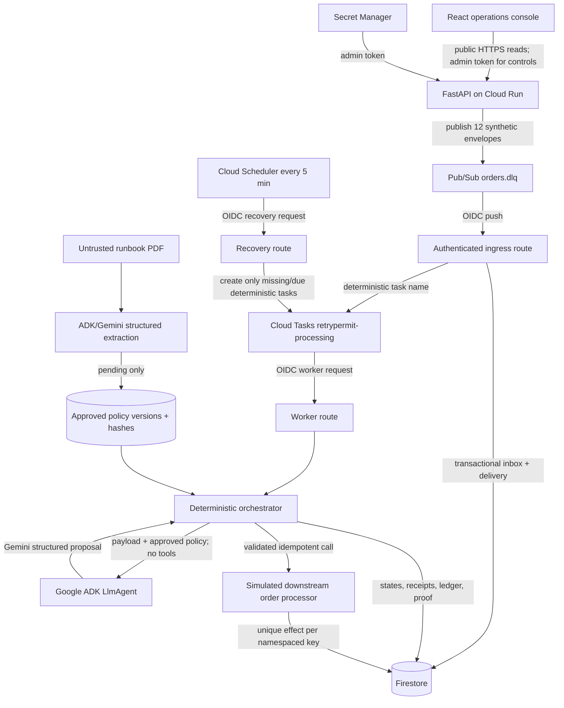

# RetryPermit architecture

RetryPermit is a policy-governed recovery service for failed events. Its core reliability claim is **at-least-once delivery with effectively-once downstream business effects**.

## Cloud architecture



## Component responsibilities

| Component | Responsibility | It does not do |
| --- | --- | --- |
| React console | Display counters, message investigation, policy and proof evidence | Hold a long-lived admin credential or execute recovery decisions |
| Cloud Run / FastAPI | Host API, ingress, worker, recovery, orchestration, and simulated downstream | Guarantee persistence from process memory |
| Pub/Sub | Deliver synthetic failed-event envelopes at least once | Guarantee one delivery or authorize replay |
| Firestore | Durable inbox, state, audit, policy, lease, ledger, and effect proof | Schedule future HTTP work |
| Cloud Tasks | Execute one deterministic task per message now or later | Decide policy or perform untracked business work |
| Cloud Scheduler | Periodically request recovery reconciliation | Replace per-message scheduling or directly replay |
| ADK/Gemini agent | Propose typed triage, evidence, clause, and allowlisted repair | Write state, publish, activate policy, mint keys, or call downstream |
| Deterministic orchestrator | Validate policy and proposal, transition state, schedule, and invoke effects | Trust model output as authority |
| Simulated downstream | Model an idempotent order effect and lost-response ambiguity | Contact a real order system |

## Delivery and acknowledgement contract

The Pub/Sub handler acknowledges only after the envelope is durably represented in Firestore and a deterministic Cloud Task is known to exist. If task creation fails, the handler returns a non-success response so Pub/Sub redelivers. If the task already exists, that is success because its deterministic name identifies the same intended work.

Local mode replaces Pub/Sub, Cloud Tasks, Firestore, and Gemini with recording/in-memory adapters. It exists for repeatable development and is not cloud durability evidence.

## Lost-response sequence

```mermaid
sequenceDiagram
    participant T as Cloud Tasks worker
    participant O as Deterministic orchestrator
    participant L as Firestore replay ledger
    participant D as Simulated downstream

    T->>O: Execute message
    O->>L: Reserve key K for payload hash H
    O->>D: Process order (K, H)
    D->>D: Commit effect E once
    D--xO: Response is deliberately lost (503)
    O->>L: Record retryable replay failure; retain K
    O-->>T: Schedule bounded retry
    T->>O: Retry same message
    O->>L: Reacquire lease for K and verify H
    O->>D: Process order again (same K, same H)
    D-->>O: Return original effect reference E
    O->>L: Confirm K → E
```

Two transport/execution attempts can occur; the unique downstream business effect remains one.

## Persistence model

Under each `demo_runs/{run_id}` namespace, Firestore holds message snapshots, ordered transitions, receipts, Pub/Sub deliveries, durable inbox records, replay-ledger records, and downstream effects. Tenant-scoped collections hold immutable policy versions plus approval and activation events. Reset rotates to a new run and preserves old evidence until its explicit expiration/cleanup path.

## Where the agent runs

In production, both the ADK runner and deterministic orchestrator execute inside the Cloud Run container. Gemini inference runs in Google's managed Vertex AI service. In the required local development mode, the same orchestrator runs on the developer machine and calls the deterministic fixture instead; no Google Cloud service is contacted.

See [the Google Cloud crash course](google-cloud-crash-course.md) for the concepts and official documentation links.
