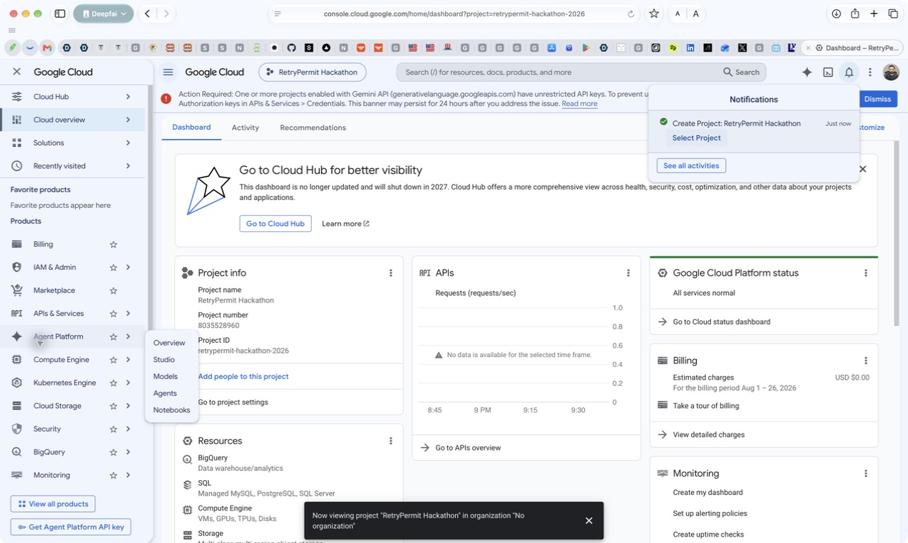
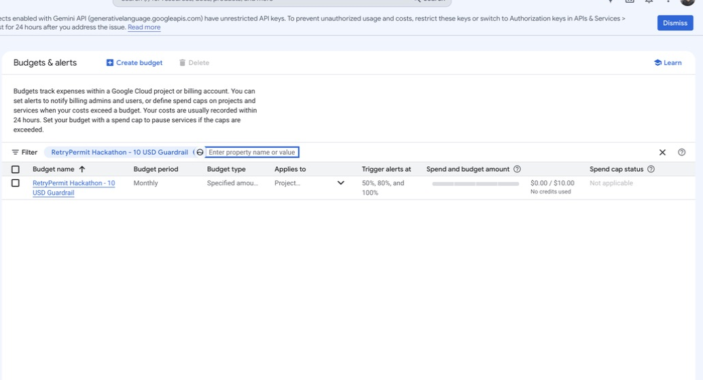
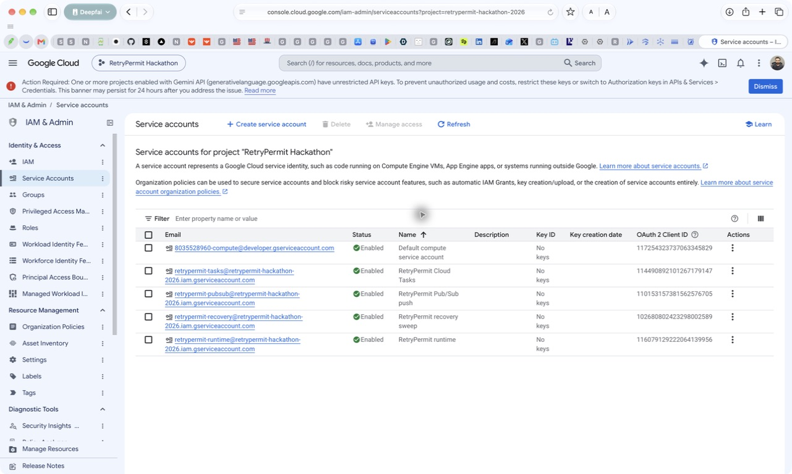
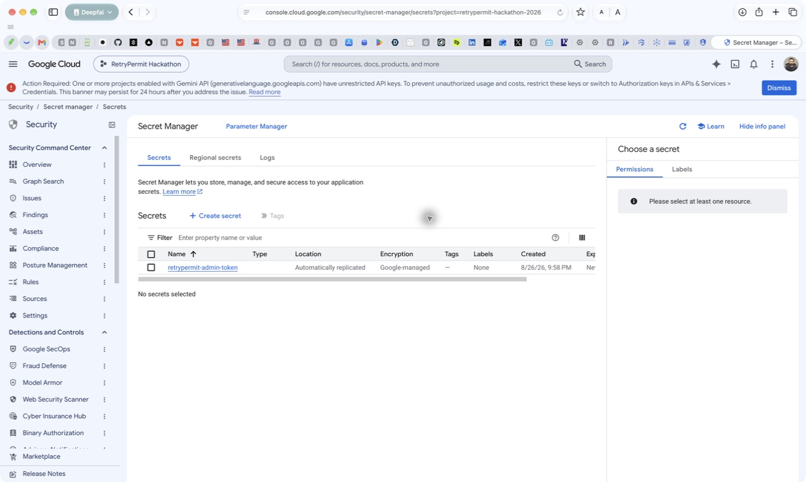
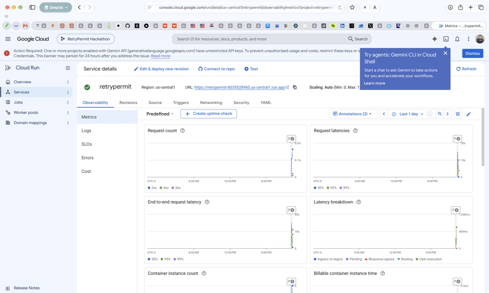
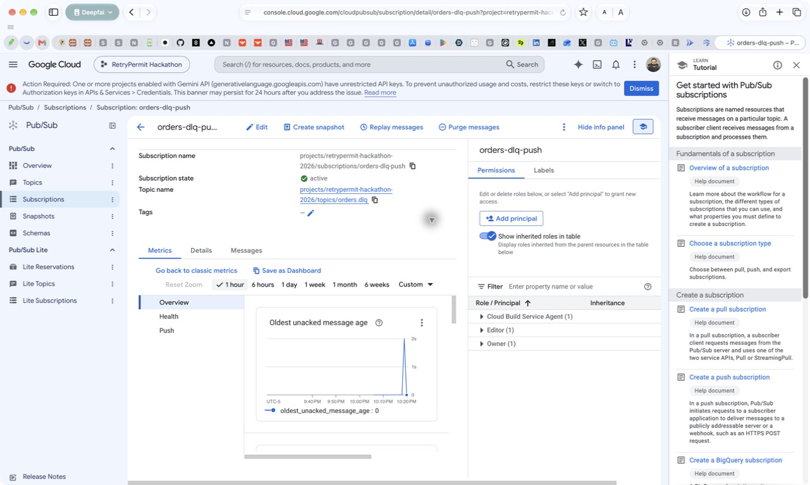
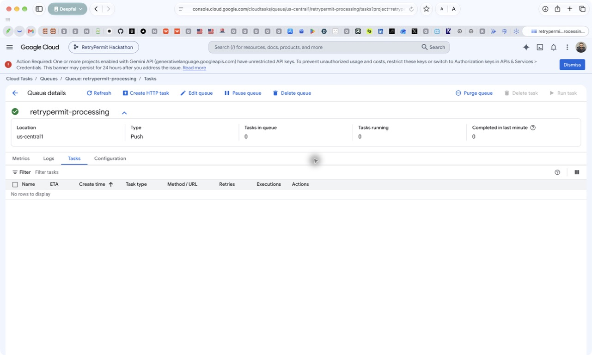
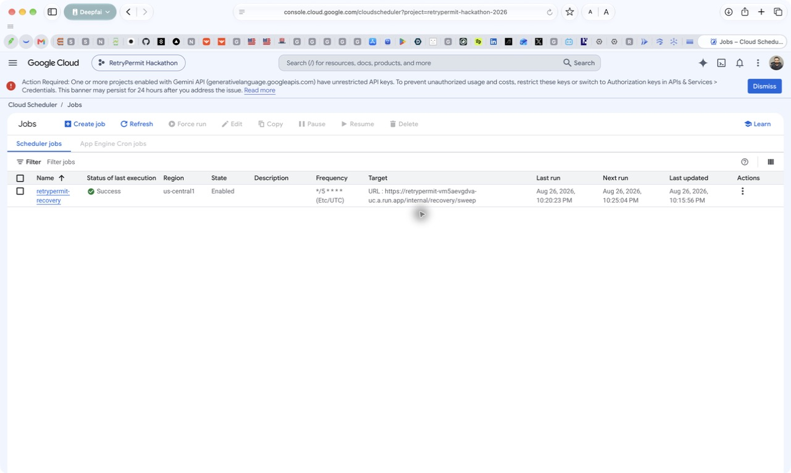
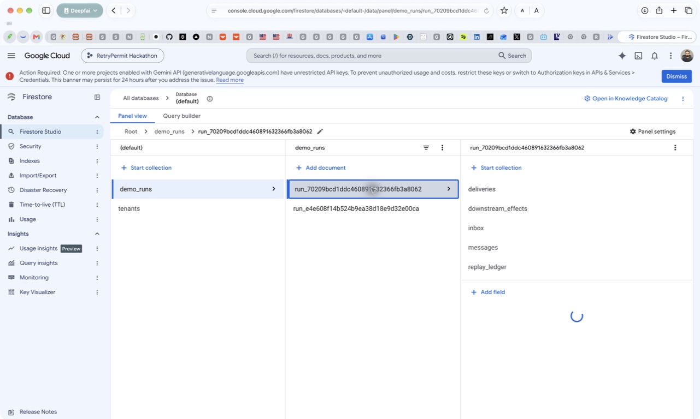
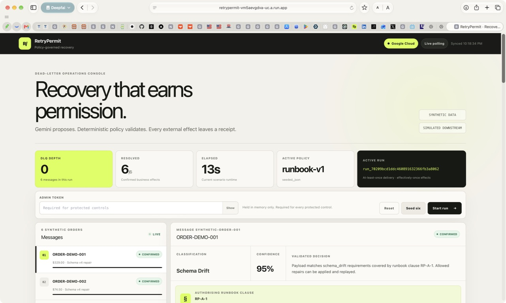

# RetryPermit Google Cloud setup — learning guide

**Configured:** 2026-08-26  
**Project:** `retrypermit-hackathon-2026`  
**Region:** `us-central1`  
**Live demo:** [RetryPermit recovery console](https://retrypermit-vm5aevgdva-uc.a.run.app)

This is a dedicated hackathon deployment. The data is synthetic and the downstream order processor is simulated. The verified delivery claim is **at-least-once delivery with effectively-once downstream business effects**, not exactly-once delivery.

## 1. Dedicated project



The deployment uses an isolated project instead of reusing an unrelated production project. This keeps billing, IAM, logs, Firestore data, and cleanup boundaries easy to understand.

## 2. Cost guardrail



The recurring monthly budget is scoped only to RetryPermit:

- Amount: **$10 USD**
- Alerts: **50% ($5), 80% ($8), and 100% ($10)**
- Current amount shown when captured: **$0.00**; billing data can be delayed

A Google Cloud budget sends alerts; it is not a hard spending cap. Cloud Run is therefore also set to scale to zero and is capped at one instance.

The reproducible setup is in `infra/setup_budget.sh`.

## 3. Keyless service identities



Four purpose-specific identities were created:

| Identity | Purpose |
| --- | --- |
| `retrypermit-runtime` | Firestore, Pub/Sub publishing, Cloud Tasks enqueueing, Vertex AI, logs, and secret access |
| `retrypermit-pubsub` | OIDC identity for authenticated Pub/Sub push delivery |
| `retrypermit-tasks` | OIDC identity for Cloud Tasks worker calls |
| `retrypermit-recovery` | OIDC identity for the scheduled recovery sweep |

The screenshot's **No keys** column is intentional: no service-account JSON keys were generated. A separate check also confirmed that this project has **zero API keys**. The unrestricted-key warning visible in some screenshots is an account-wide console banner and does not describe this project.

The default compute service account has only the build role needed by current Cloud Run source deployments. The application revision runs as `retrypermit-runtime`, not as the default build identity.

## 4. Secret Manager



`retrypermit-admin-token` stores the protected-control token. Its value was generated randomly, never placed in source code, never compiled into the frontend, and is mounted into Cloud Run from Secret Manager.

To retrieve it locally when operating the demo, use an authenticated terminal and do not paste the result into logs or screenshots:

```bash
gcloud secrets versions access latest \
  --secret=retrypermit-admin-token \
  --project=retrypermit-hackathon-2026
```

The browser retains the token in memory only after you enter it.

## 5. Cloud Run



The service is deployed in `us-central1` with:

- request-based billing
- minimum instances: **0**
- maximum instances: **1**
- 1 vCPU, 1 GiB memory
- concurrency: 20
- public read-only demo access
- protected admin routes using `X-Admin-Token`
- private transport routes requiring the exact Google-signed OIDC identities

The public endpoint was explicitly approved for the hackathon. Keep the one-instance cap and remove public invocation after judging if the demo no longer needs to be externally reachable.

## 6. Authenticated Pub/Sub delivery



The `orders.dlq` topic feeds the active `orders-dlq-push` subscription. It pushes to `/pubsub/dlq` using the dedicated `retrypermit-pubsub` OIDC identity. The captured metrics show no remaining unacknowledged backlog after the acceptance run.

## 7. Durable Cloud Tasks processing



`retrypermit-processing` is a running push queue in `us-central1`. Task names are deterministic, and workers are called with the `retrypermit-tasks` OIDC identity. The queue is empty in the screenshot because every acceptance-run task completed.

## 8. Scheduled recovery



`retrypermit-recovery` runs every five minutes. It calls `/internal/recovery/sweep` with the dedicated recovery OIDC identity. The screenshot records an enabled job and a successful last execution.

This sweep repaired the deliberately interrupted first cloud test without duplicating a downstream effect, which is useful crash-recovery evidence.

## 9. Firestore durability



The default Firestore Standard database is in `us-central1` and received the live run. Each `demo_runs` document owns the durable evidence subcollections, including:

- `deliveries`
- `downstream_effects`
- `inbox`
- `messages`
- `replay_ledger`

The independent acceptance-test query found six message documents and exactly six unique downstream-effect documents.

## 10. Completed live run



The final clean acceptance run completed in about 17 seconds:

- DLQ depth: **0**
- resolved messages: **6/6**
- model: **Google ADK with Gemini 3.7 Flash**
- persisted Firestore run status: **COMPLETE**
- confirmed unique downstream effects: **6**

Verification commands:

```text
tests/deployed/test_deployed_vertical_slice.py  1 passed in 19.78s
tests/deployed/test_real_gemini.py               1 passed in 5.94s
local suite                                      27 passed, 2 intentionally skipped
```

## Expected hackathon cost

At demo-scale traffic, a realistic expectation is **approximately $0–$2 for the hackathon**, although public traffic and unusually large prompts can increase it. The main variable cost is Gemini. As of this deployment, Gemini 3.7 Flash global introductory pricing is $0.75 per million input tokens and $3.75 per million output tokens through December 31, 2026.

Most other usage should remain within free allowances at hackathon scale:

- Cloud Run scales to zero and has monthly CPU/RAM free allowances.
- Firestore's default database includes daily read/write/delete quotas and 1 GiB storage.
- Pub/Sub includes the first 10 GiB of basic message throughput per billing account each month.
- Cloud Tasks includes the first one million operations per month.
- One Scheduler job is normally covered by the three-job billing-account allowance; otherwise it is $0.10 per job per month.

Check the Billing report after its normal reporting delay. Treat the $10 budget as an alerting boundary, not as an automatic shutdown switch.

## Reproduce or update

```bash
export GCP_PROJECT_ID=retrypermit-hackathon-2026
export GCP_REGION=us-central1
export GEMINI_LOCATION=global

./infra/setup_budget.sh
./infra/preflight.sh

export DEMO_ADMIN_TOKEN='<new-long-random-value>'
export CONFIRM_RETRYPERMIT_PROJECT=yes
export CONFIRM_BUDGET_SAFEGUARDS=yes
./infra/deploy.sh
```

`infra/deploy.sh` is idempotent. It enables APIs, ensures identities and bindings, rotates the Secret Manager version, creates missing managed resources, deploys the application, updates authenticated push targets, and checks `/health`.

After both credentialed live tests pass, set the guarded evidence flag:

```bash
export CONFIRM_LIVE_TESTS_PASSED=yes
./infra/mark_cloud_verified.sh
```
