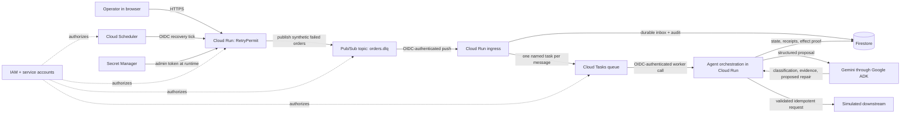

# Google Cloud crash course for RetryPermit

This guide explains the Google Cloud concepts in the order a RetryPermit message experiences them. It is a learning guide, not a claim that the current local run exercised Google Cloud. Phase 2 has historical cloud evidence; the Phase 3 and Phase 4 behavior still needs an explicitly authorized final cloud verification.

## The whole system in one picture

The agent runs inside the RetryPermit Cloud Run container. Google ADK organizes the model call; Gemini proposes a typed decision. The surrounding Python application—not Gemini—loads the active policy, validates the proposal, changes state, schedules tasks, creates the idempotency key, and calls the simulated downstream.

## The 60-second mental model

- **Cloud Run** is the computer: it starts a container when an HTTP request arrives and can scale back to zero.
- **Pub/Sub** is the incoming event queue: publishers do not need to know which worker handles an event, and delivery is at least once.
- **Firestore** is durable memory: it stores the inbox, state transitions, receipts, policy versions, replay ledger, and independently queryable downstream-effect proof.
- **Cloud Tasks** is the controlled work queue: each message receives a deterministic task name and, when needed, a future execution time.
- **Cloud Scheduler** is an alarm clock, not a queue: every five minutes it asks RetryPermit to find work that should exist but may have been missed.
- **Google ADK + Gemini** is the advisory agent: it returns a structured triage proposal but receives no side-effecting tools.
- **IAM and OIDC** answer “which machine is calling?” Private transport routes accept only the expected service identity.
- **Secret Manager** supplies the administrator token without placing it in source code or the browser bundle.
- **Cloud Logging** receives structured container logs for investigation and demo evidence.
- **Cloud Billing budgets** send alerts. They are not a hard spending cap.

## One message, end to end

1. The operator starts a synthetic run in the browser.
2. Cloud Run publishes the 12 failed-order envelopes to the `orders.dlq` Pub/Sub topic.
3. Pub/Sub pushes an envelope back to the service with a Google-signed OIDC token.
4. RetryPermit verifies the caller identity and records a durable Firestore inbox item.
5. It creates a Cloud Task with a deterministic name. Only after durability and scheduling are known does it acknowledge Pub/Sub.
6. Cloud Tasks calls the worker route with its own OIDC identity.
7. The orchestrator loads the approved, active, hash-bound policy and asks Gemini through ADK for a strict triage proposal.
8. Deterministic validation accepts or rejects the proposal. It may repair and replay, defer for a scheduled recheck, escalate, or quarantine.
9. A replay uses a namespaced idempotency key. The ledger moves through `RESERVED` and `EXECUTING` to `CONFIRMED` only after a confirmed downstream receipt.
10. Every transition and external attempt/result becomes an audit receipt in Firestore. The UI polls read-only APIs to display that evidence.

## Queue concepts

### Pub/Sub: event delivery

Pub/Sub decouples the publisher from RetryPermit. Delivery is **at least once**, so duplicate envelopes are normal. RetryPermit must deduplicate; Pub/Sub is not asked to pretend duplicates cannot happen.

Learn: [Pub/Sub overview](https://docs.cloud.google.com/pubsub/docs/overview) and [authenticated push subscriptions](https://docs.cloud.google.com/pubsub/docs/authenticate-push-subscriptions).

### Cloud Tasks: controlled execution and rechecks

Cloud Tasks provides an HTTP work queue with retry behavior, concurrency/rate limits, deterministic task names, and a future `schedule_time`. RetryPermit uses one task per message. Class B rechecks and replay retries extend this same mechanism.

Learn: [Cloud Tasks overview](https://docs.cloud.google.com/tasks/docs/dual-overview) and [HTTP targets with OIDC](https://docs.cloud.google.com/tasks/docs/creating-http-target-tasks).

### Cloud Scheduler: recovery net

Scheduler periodically invokes `/internal/recovery/sweep`. The sweep does not execute business effects. It detects expired leases, unscheduled inbox items, and due retry/deferred records, then recreates deterministic Cloud Tasks. Overlapping scheduler calls are therefore safe.

Learn: [Cloud Scheduler overview](https://docs.cloud.google.com/scheduler/docs/overview) and [authenticated HTTP targets](https://docs.cloud.google.com/scheduler/docs/http-target-auth).

## Compute and scale

Cloud Run hosts the React application, FastAPI API, authenticated transport handlers, orchestrator, and simulated downstream in one container for the hackathon. `min-instances=0` allows scale-to-zero; `max-instances=1` constrains demo cost and concurrency. A production system could split the API, worker, and downstream into separate services.

Learn: [Cloud Run overview](https://docs.cloud.google.com/run/docs/overview/what-is-cloud-run), [deploying from source](https://docs.cloud.google.com/run/docs/deploying-source-code), [public access](https://docs.cloud.google.com/run/docs/authenticating/public), and [container concurrency](https://docs.cloud.google.com/run/docs/about-concurrency).

## Durable state, transactions, leases, and idempotency

Firestore is a document database. RetryPermit uses transactions where two workers could race: delivery deduplication, transition sequence allocation, replay-lease acquisition, policy activation, ledger updates, and downstream-effect uniqueness.

A **lease** is time-limited ownership. If a worker dies while holding it, another worker can recover the work after expiration. An **idempotency key** names one intended business effect. Repeating the same request/key returns the original reference instead of creating a second effect.

This is why the precise claim is **at-least-once delivery with effectively-once downstream business effects**, never exactly-once delivery.

Learn: [Firestore overview](https://docs.cloud.google.com/firestore/docs/overview), [transactions](https://docs.cloud.google.com/firestore/docs/manage-data/transactions), and [transaction contention](https://cloud.google.com/firestore/docs/transaction-data-contention).

## Agent, model, and policy boundary

The Google ADK `LlmAgent` runs in the Cloud Run process and invokes Gemini on Vertex AI. It receives a payload and approved policy context and returns a structured triage proposal. It has no tool that can publish, write Firestore, call the downstream, approve policy, or activate policy.

The deterministic application validates schema, payload hash, allowed repair operations, policy clause, safety cap, retry budget, and final payload. Model confidence is evidence, not authority. A PDF-extracted policy is untrusted and remains `PENDING_APPROVAL` until separate audited approval and activation.

Learn: [Agent Development Kit](https://google.github.io/adk-docs/), [ADK agents](https://google.github.io/adk-docs/agents/), [Vertex AI generative AI](https://docs.cloud.google.com/vertex-ai/generative-ai/docs/overview), and the [Google Gen AI SDK](https://cloud.google.com/vertex-ai/generative-ai/docs/sdks/overview).

## Identity and security

An IAM grant reads: **principal + role + resource**. RetryPermit uses separate service accounts for the runtime, Pub/Sub push, Cloud Tasks, and Scheduler recovery. This limits the damage if one path is misused and makes the caller visible in audit trails.

OIDC is a signed identity token for an HTTP request. Cloud Run validates the token; RetryPermit also checks that the expected service-account email is the caller. The public UI is intentionally reachable, but mutating demo controls require an administrator token and machine routes require their dedicated Google identity.

Learn: [IAM overview](https://docs.cloud.google.com/iam/docs/overview), [service accounts](https://docs.cloud.google.com/iam/docs/service-account-overview), [service-account security](https://docs.cloud.google.com/iam/docs/best-practices-service-accounts), and [Application Default Credentials](https://docs.cloud.google.com/docs/authentication/application-default-credentials).

## Secrets, logs, and cost controls

Secret Manager stores the administrator token and injects it into Cloud Run at runtime. It is not an API key for Gemini. Production model access uses the Cloud Run runtime service account and Application Default Credentials, so a user-managed Gemini API key is unnecessary for this architecture.

Structured Cloud Run logs show requests and application events. Avoid logging payload secrets or the administrator token. The demo uses synthetic data, which reduces privacy risk but does not eliminate credential risk.

The project budget alerts at configured thresholds, while scale-to-zero and a one-instance maximum reduce idle and runaway compute. Budget alerts do **not** stop services automatically; the owner must monitor and disable resources if necessary.

Learn: [Secret Manager overview](https://docs.cloud.google.com/secret-manager/docs/overview), [Cloud Run logging](https://docs.cloud.google.com/run/docs/logging), [budgets and alerts](https://docs.cloud.google.com/billing/docs/how-to/budgets), and [Vertex AI pricing](https://cloud.google.com/vertex-ai/generative-ai/pricing).

## How the four failure classes use the platform

| Class | Example | Result | Cloud mechanism |
| --- | --- | --- | --- |
| A | Schema-v2 order needs an allowlisted rename/coercion | Repair and replay | Pub/Sub → task → agent proposal → deterministic validation → ledger/effect |
| B | Inventory dependency returns 503 | Defer, schedule a per-message recheck, then replay unchanged | Future Cloud Task; Scheduler only repairs missed scheduling |
| C | Negative quantity or disallowed currency | Escalate with proposed correction, no replay | Firestore escalation/receipt; no downstream effect |
| D | Instruction embedded in order notes | Quarantine and record refusal | Deterministic instruction boundary plus model flag; no downstream effect |

## Suggested learning order (about 90 minutes)

1. **10 min:** Read the Cloud Run overview and identify the single RetryPermit container.
2. **15 min:** Read Pub/Sub delivery and authenticated push; explain why duplicates are expected.
3. **15 min:** Read Cloud Tasks and compare `schedule_time` with Scheduler's recurring clock.
4. **15 min:** Read Firestore transactions; trace where duplicate workers could race.
5. **15 min:** Read IAM/service accounts and map the four RetryPermit identities.
6. **10 min:** Read ADK agents and state the model's proposal-only boundary.
7. **10 min:** Read budgets/logging and explain why an alert is not a spending cap.

Then trace one message in [architecture.md](architecture.md), follow its legal state transitions in [state-machine.md](state-machine.md), and inspect the trust boundaries in [security.md](security.md).
