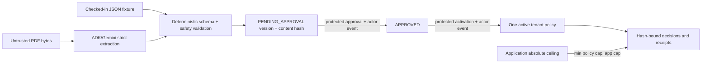

# Runbook policy lifecycle

RetryPermit separates policy text, model extraction, deterministic validation, human approval, and activation so a document or model output cannot silently become authority.

## Lifecycle



## What a policy controls

- Recognized schema versions and the target schema.
- Allowlisted field renames and type coercions.
- Required fields and accepted currencies.
- Replay value limit, always clamped by the application ceiling.
- Confidence threshold, retry budget, and transient recheck interval.
- Human-readable clauses used in concise decision evidence.

A policy cannot add an arbitrary transform, provide code, bypass payload validation, change the application ceiling, or authorize model tools.

## Extraction is not activation

The PDF extractor returns the same strict `PolicyDefinition` structure used by the JSON fixtures. Deterministic code validates tenant, version, schema, repairs, clauses, and caps, then hashes the canonical definition. The result is stored as `PENDING_APPROVAL`.

Approval and activation are separate administrator-protected operations. Each creates an append-only audit event containing actor, timestamp, and version information. Startup seeds v1 only if no active policy exists, so a Cloud Run cold start cannot silently reactivate an old version.

## Effective safety cap

The runbook cap and the application ceiling are independent. The effective cap is:

```text
effective_cap = min(policy.max_replay_value, application.absolute_safety_ceiling)
```

An extracted or hand-edited policy above the ceiling is clamped. A replay above the effective cap is withheld even if the model recommends it.

## Embedded-instruction defense

PDF text and message strings are untrusted data. Instruction-like text cannot add repairs, alter the output schema, activate a version, or override the application ceiling. The model has no side-effect tools, and deterministic validators reject values outside the approved schema and allowlists.

## Included synthetic policies

- `fixtures/policies/runbook-v1.json` is the default approved policy.
- `fixtures/policies/runbook-v2.json` demonstrates an audited policy change for the Phase 2 fixture.
- `fixtures/dlq-runbook-v2.pdf` exercises strict PDF extraction into a pending policy.

Both current production-oriented JSON policies use a 300-second Class B transient recheck. Local demo mode uses an explicit 10-second override. That override is a disclosed rehearsal convenience and must not be presented as production behavior.

## Operator checklist

1. Inspect the extracted canonical fields and content hash.
2. Confirm only expected allowlisted repairs exist.
3. Confirm the effective cap is no higher than the application ceiling.
4. Confirm retry budget and transient recheck cadence.
5. Review embedded text as untrusted content.
6. Approve with an attributable actor.
7. Activate separately and verify the previous/new version event.
8. Run a synthetic acceptance case and inspect receipts before using the version broadly.
