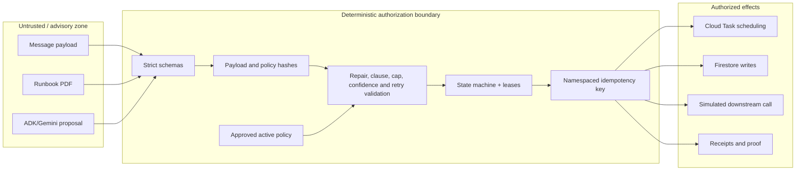

# RetryPermit security boundaries

RetryPermit treats event payloads, PDF text, model output, and operator-supplied identifiers as untrusted input. Its central rule is: **the model proposes; deterministic code executes**.

## Permission boundary

| Capability | ADK/Gemini may propose | Deterministic code alone may execute |
| --- | :---: | :---: |
| Classify the failure and cite evidence | Yes | Validates and records |
| Suggest an allowlisted repair | Yes | Yes, after schema/policy/cap validation |
| Publish a Pub/Sub message | No | Yes |
| Write Firestore state or receipts | No | Yes |
| Schedule or retry a Cloud Task | No | Yes |
| Mint/reuse an idempotency key | No | Yes |
| Call the downstream | No | Yes |
| Approve or activate a policy | No | Protected operator action only |
| Exceed the application safety ceiling | No | No |

The agent is configured without tools. Its typed output is evidence offered to the validator, not a command channel.

## Machine-to-machine authentication

| Caller | Target | Identity/control |
| --- | --- | --- |
| Pub/Sub | `/pubsub/dlq` | Dedicated push service account, Google-signed OIDC token, exact caller and subscription-resource checks |
| Cloud Tasks | private worker route | Dedicated task service account, OIDC audience equal to Cloud Run base URL |
| Cloud Scheduler | `/internal/recovery/sweep` | Dedicated recovery service account and OIDC audience |
| Cloud Run application | Firestore, Pub/Sub, Tasks, Vertex AI, Logging | Attached runtime service account with purpose-limited IAM roles |
| Human operator | mutating demo/policy routes | `X-Admin-Token` supplied at runtime from Secret Manager |

The deployment permits public access to the read-only synthetic demo UI. Public reachability does not remove application-level authorization from machine and mutation routes.

## Policy supply-chain safety

1. A checked-in or extracted policy is validated against a strict schema.
2. The application ceiling clamps the policy's configured ceiling.
3. PDF extraction creates only a `PENDING_APPROVAL` version.
4. Approval and activation are separate protected operations with actor/timestamp events.
5. The active policy content hash is carried into decisions and replay evidence.
6. Embedded instructions in a runbook or payload do not expand permissions.

## Idempotency and ambiguity safety

An idempotency key is scoped to the run/message and bound to the payload hash. The replay ledger uses a lease so a dead worker can be recovered. If the downstream commits an effect but the response is lost, retry uses the same key and hash. The simulated downstream returns the original effect reference; it does not create a second effect.

This produces effectively-once business effects on top of at-least-once delivery. It does not make an exactly-once transport claim.

## Secrets and data

- No API key or service-account JSON is required in the repository.
- Cloud Run uses its attached service account through Application Default Credentials.
- The administrator token is stored in Secret Manager and injected at runtime.
- Local `.env` and credentials are ignored by Git.
- All included orders, customers, products, policies, and recipients are synthetic.
- The downstream is a simulated idempotent order processor hosted inside the demo service.
- Hidden chain-of-thought is neither requested nor persisted; concise evidence and policy citations are recorded.

## Residual risks and production hardening

The hackathon deployment intentionally combines API, worker, and simulated downstream in one service. A production release should separate trust/scaling domains, use a real downstream contract, add organization-level monitoring and incident response, perform independent threat modeling, validate retention requirements, and complete name/licensing/commercial clearance.
