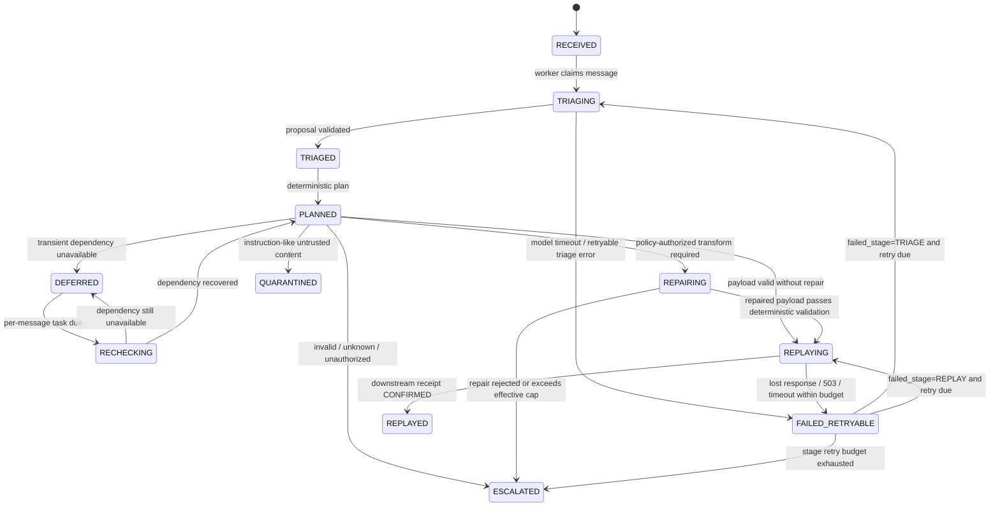

# RetryPermit state machine

Every message transition is explicit, validated, sequence-numbered, and recorded. Terminal states are `REPLAYED`, `ESCALATED`, and `QUARANTINED`; a retryable failure is not terminal.

## Why `failed_stage` matters

`FAILED_RETRYABLE` is shared by errors from different work. RetryPermit persists `failed_stage` so recovery resumes the interrupted stage:

| `failed_stage` | Resume path | What is not repeated unnecessarily |
| --- | --- | --- |
| `TRIAGE` | `FAILED_RETRYABLE → TRIAGING` | No replay is attempted before a valid proposal exists |
| `REPLAY` | `FAILED_RETRYABLE → REPLAYING` | The same approved plan and idempotency key are reused |

Retry exhaustion produces an explicit escalation rather than an infinite loop.

## Outcome paths

- **Class A:** `RECEIVED → TRIAGING → TRIAGED → PLANNED → REPAIRING → REPLAYING → REPLAYED`.
- **Class B:** `... → PLANNED → DEFERRED → RECHECKING → PLANNED → REPLAYING → REPLAYED`.
- **Class C:** `... → PLANNED → ESCALATED`; no downstream call is allowed.
- **Class D:** `... → PLANNED → QUARANTINED`; instruction text is inert and no downstream call is allowed.
- **Lost response:** `... → REPLAYING → FAILED_RETRYABLE → REPLAYING → REPLAYED`, using the same key.

## State invariants

1. The payload hash bound to a replay key cannot change on retry.
2. A confirmed ledger record points to exactly one downstream reference.
3. A terminal Class C or D message has no downstream effect.
4. Policy extraction cannot activate a policy.
5. Recovery can recreate work but cannot bypass the state machine or authorization checks.
6. The application safety ceiling clamps every runbook value.
